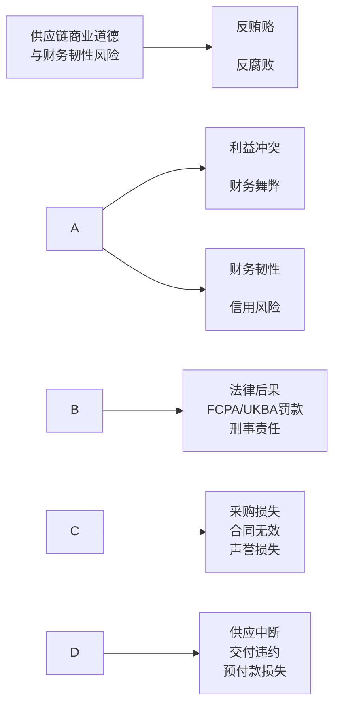
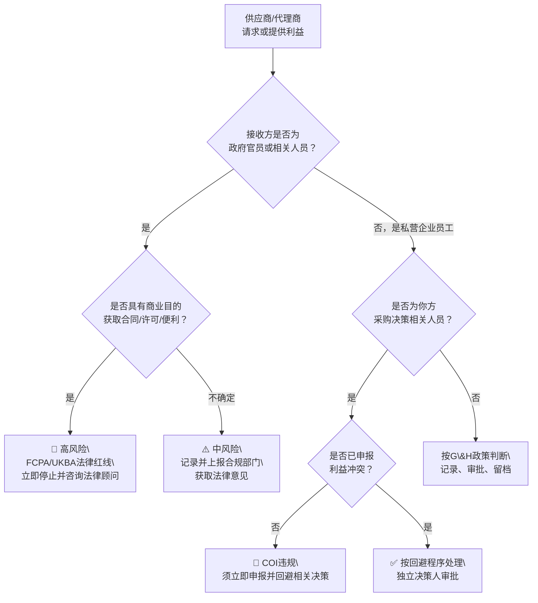
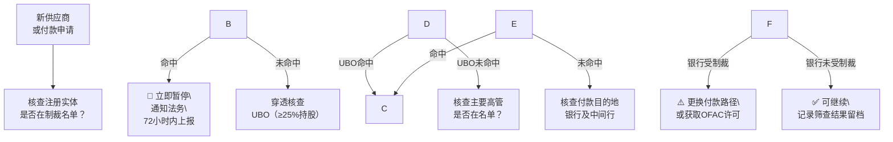
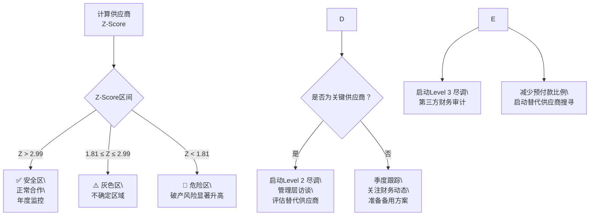
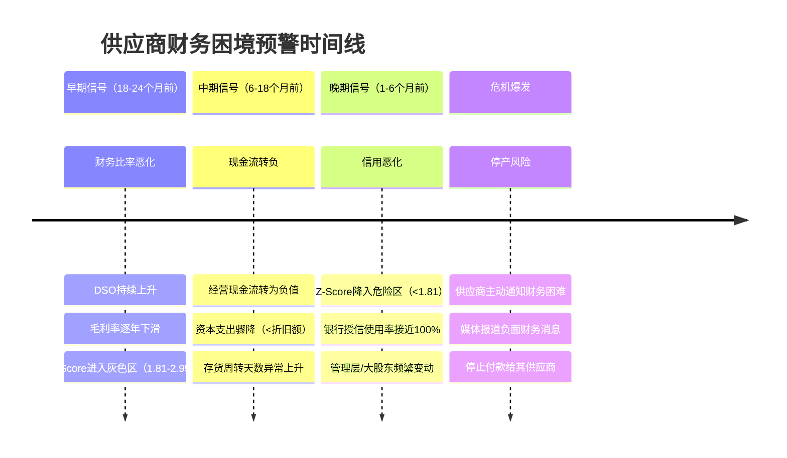
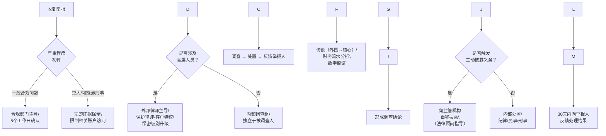

# 供应链尽责管理实操指南

# 商业道德与财务韧性审核指南

2025年版　适用范围：所有规模企业及其供应商

---

# 前言

商业贿赂、利益冲突与财务舞弊是供应链中三种最常被忽视、却后果最严重的合规风险。

近年来，数家跨国企业因供应商行贿案被罚款逾数十亿美元；美国证券交易委员会（SEC）就供应链相关的FCPA违规案件持续开出巨额罚单。在国内，受制于《反不正当竞争法》和《刑法》商业贿赂条款，供应链贿赂案件的查处力度持续加强。这些案例有一个共同点：**问题往往起源于供应链某个层级的不当行为，但最终由采购方共同承担了法律后果。**

与此同时，供应商的财务健康状况正成为供应链韧性的核心议题。新冠疫情期间，全球数以千计的供应商因资金链断裂而停产，直接导致大量品牌商的生产中断。货币贬值、通货膨胀、信贷收紧等宏观环境变化，持续考验着中小供应商的财务稳健性。对采购方而言，供应商的财务状况不仅是信用风险，更是供应连续性的核心保障。

本指南是《供应链尽责管理实操指南》的组成部分，覆盖：

* 反贿赂与反腐败的法律框架（FCPA、英国《反贿赂法》、中国相关法律）
* 礼品、招待与第三方支付管控
* 利益冲突识别与管理
* 制裁合规与出口管制基础知识
* 供应商财务健康评估指引（财务比率、Altman Z-score、现金流分析）
* 供应商财务韧性尽职调查流程
* 审核指引与检查清单

::: tip 如何使用本指南
**线性阅读：** 从第一章开始，循序建立完整的商业道德与财务韧性管理框架。

**按需查阅：** 每章开头的"本章要点"已完整概括核心内容，可独立阅读任意章节。

**审核准备：** 直接跳至第八章（审核指引）和第九章（检查清单）。

**快速了解财务风险：** 直接进入第五章（财务健康评估）和第六章（尽职调查流程）。
:::

---

# 第一章　商业道德与财务韧性在尽责管理体系中的定位

> \*场景：\* 贵司采购团队与一家供应商合作了三年，关系顺畅，价格有竞争力。某天，一封匿名举报邮件到达贵司合规部门：这家供应商的销售总监，每季度通过一个第三方咨询公司向贵司采购总监的配偶转账。贵司调查后发现，这三年向该供应商支付的采购价格与市场平均价格一致。请问，这跟商业道德可能有什么关系？

::: tip 本章要点

* 商业道德合规不仅是"管好自己的员工"，美国FCPA和英国《反贿赂法》均规定企业须为**供应商/代理商的行为**承担连带责任
* 供应商财务状况恶化通常在**实际停产前6-18个月**已在财务数据中留下信号
* 三大核心风险域（反贿赂、利益冲突/舞弊、财务韧性）相互关联：财务困难是腐败行为的重要动因之一
* 尽调强度应与供应商的**战略重要性×风险特征**匹配，而非一刀切
* 本套指南六个专项领域合计覆盖欧盟CSDDD要求评估的全部实质性风险类别
  :::

## 1.1　为什么商业道德与财务韧性是尽责管理支柱而非内控事项

传统上，企业将反腐败合规视为内部治理问题——管好自己的员工不行贿即可。然而，在全球化供应链中，这一认知已严重滞后。原因在于：

* **连带责任扩张：** 美国FCPA、英国《反贿赂法》均明确规定，企业因未能阻止代理人/供应商/合营方的行贿行为而承担责任，即便企业本身不知情
* **供应链作为行贿通道：** 实践中大量海外腐败案件通过供应商/代理商层级发生——采购方支付溢价给中间商，后者再行贿予采购方目标国的官员
* **财务舞弊向上传导：** 供应商财务造假（虚增营收、虚报资产、隐瞒债务）直接影响采购方的供应链风险判断，导致错误的供应商选择和集中度决策
* **ESG披露驱动：** CSRD（欧盟企业可持续发展报告指令）、GRI 205（反腐败）要求企业报告供应链反腐败措施；未报告或报告不实面临监管风险

好的商业道德实践必然有好的内控，反之则不尽然。我们回答过”为什么需要六个支柱“的问题，其中举了个例子，即财务韧性差的企业，大概率缺乏对供应链的调度能力，也更容易受到高风险但低成本的供应诱惑，也更容易铤而走险、漠视商业道德。

## 1.2　三个核心风险域



|风险域|核心问题|主要法律后果|尽责管理工具|
|-|-|-|-|
|反贿赂/反腐败|供应商是否通过行贿获取合同/许可证？采购员工是否收受回扣？|FCPA/UKBA民事/刑事处罚；采购合同无效；声誉损失|供应商尽职调查；第三方背调；礼品记录审查；付款异常分析|
|利益冲突/财务舞弊|采购决策人员与供应商之间是否存在隐性关联？供应商财务数据是否真实？|采购合同可能被撤销；内部人员面临劳动法/刑法追责；财务损失|利益冲突申报制度；供应商UBO核查；财务报表审阅|
|财务韧性/信用风险|供应商是否具备持续运营能力？关键供应商财务恶化是否会导致供应中断？|供应中断风险；交付违约；预付款损失；产能重建成本|财务比率分析；信用评级；现金流评估；替代供应商测试|

## 1.3　供应商类型与尽责管理强度匹配

与尽责管理其他五个支柱一样，商业道德和财务韧性的管理强度也应该和供应商的战略重要性及其风险特征相当：

|维度|高风险标准（需深度尽调）|低风险标准（标准尽调）|
|-|-|-|
|地理风险|供应商位于CPI（腐败感知指数）得分低于40的国家；高腐败风险行业（矿产、基础设施、海关）|CPI高分国家；成熟市场|
|战略重要性|单一关键材料来源；替代周期>6个月；占采购金额>10%|标准化商品；多供应商竞争格局|
|第三方代理商|使用本地代理商开展业务；代理商参与政府关系/海关清关|直接采购；无代理商介入|
|付款方式|预付款>20%；资金转至第三国账户；使用现金支付|标准账期支付；正常银行转账|
|财务透明度|财务报告未经审计；没有财务报告或拒绝提供财务信息；近期股东/管理层变动频繁|年审财务报告；稳定管理团队|

::: warning 常见误区
**误区1：** "我们规模不大，不会被FCPA盯上。" — FCPA的执法对象包括任何使用美元结算或与美国上市公司有业务往来的企业，与企业规模无关。

**误区2：** "供应商的腐败行为是他们自己的问题。" — 一旦你的采购行为（包括支付溢价）成为腐败链条的一部分，做为采购方的你可能需要承担连带责任。

**误区3：** "财务评估是财务部的事，跟采购合规无关。" — 财务困难的供应商更容易出现腐败行为（用回扣换合同）和质量造假，三大风险域高度相关。

**误区4：** "我们每年审核一次就够了。" — 财务状况可在几个月内急剧恶化；制裁名单不定时更新。年度审核对财务风险和制裁风险来说频率远远不够。
:::

---

# 第二章　全球反贿赂与反腐败法律框架

> \*场景：\* 你的新代理商在东南亚市场表现出色，但他要求的佣金是行业惯例的两倍，并坚持付款打到新加坡一家你从未听说过的公司账户。他说"这是当地做事的方式"。你怎么判断这是否越过了法律红线？

::: tip 本章要点

* 全球三大法律框架（FCPA、英国UKBA、中国法律）的管辖范围相互叠加，向中国出口的企业三者可能同时适用
* FCPA最大的误解：它**不仅适用于美国企业**，任何使用美元、在美上市、或涉及美国人的交易均受管辖
* 英国UKBA比FCPA更严：它**同时禁止私营部门贿赂**（不仅限于政府官员），且无需证明受贿方是政府官员
* 90%以上的FCPA/UKBA案件涉及**第三方**（代理商、经销商、顾问）——管控代理商比管控自身员工更难
* ISO 37001是目前唯一专门针对反贿赂管理体系的可认证国际标准，可用于评估供应商的合规成熟度
  :::

## 2.1　三大核心法律体系

|法律|管辖范围|核心义务|主要处罚|供应链特殊规定|
|-|-|-|-|-|
|美国《海外反腐败法》（FCPA, 1977年）|任何在美国证券交易所上市的公司；在美国境内使用美元的交易；以及美国人（自然人和法人）的任何行为|禁止向外国政府官员行贿以获取或保留商业利益；要求上市公司建立内部会计控制系统|企业罚款无上限（基于获利额的2倍）；个人最高20年监禁；司法部和SEC联合执法|对第三方（代理商/供应商/合营方）的贿赂行为负有连带责任；须对代理商进行适当背景调查|
|英国《反贿赂法》（UKBA, 2010年）|在英国注册成立、或在英国开展业务的所有机构（无论贿赂发生地）；对外国公司亦有适用|禁止行贿和受贿（**含私营部门**）；商业组织有义务阻止关联人员行贿（六项充分程序原则）|企业无上限罚款；个人最高10年监禁；较FCPA管辖范围更广（含私营贿赂）|供应商和代理商属于关联人员；企业须证明已采取充分预防程序（Adequate Procedures）方可抗辩|
|中国反腐败法律框架（多法合一）|在中国境内经营的所有企业；向国家工作人员行贿适用《刑法》第389-390条；商业贿赂适用《反不正当竞争法》第7条|禁止向国家工作人员行贿；禁止在商业活动中向对方员工行贿/受贿；国有企业贿赂行为适用更严格标准|商业贿赂：行贿方罚款最高500万元；受贿方处罚金+有期徒刑；行贿额≥10万元可构成刑事犯罪|供应商代表向采购方员工行贿（客户回扣）和采购方员工索贿均违法；双方均需自证清白|

**判断一笔支付是否触发法律红线——决策树：**



## 2.2　ISO 37001：反贿赂管理体系标准

ISO 37001:2016（反贿赂管理体系）是一套可认证的反贿赂管理框架，被许多跨国企业作为供应商准入标准之一。理解ISO 37001有助于评估供应商的反腐败合规成熟度。

|要素|核心内容|对供应商的意义|
|-|-|-|
|领导力与承诺|最高管理层须明确示范反腐败立场；任命合规官；将反腐败纳入企业文化|最高管理层亲自签署反腐败政策；供应商管理层可直接回答合规问题|
|风险评估|识别并评估组织面临的贿赂风险（地理、行业、业务模式、客户类型）|供应商须展示腐败风险图谱，识别高风险业务场景|
|尽职调查|对商业伙伴（含供应商、代理商、合营方）进行与其风险水平相称的背景调查|供应商须证明其对自身供应商/代理商进行了反腐败尽调|
|财务控制|建立针对腐败风险的财务控制措施（双签审批、费用记录、礼品台账）|供应商须具备采购/销售活动的双重审批记录；费用报销有政策约束|
|举报机制|建立保护举报人的举报渠道；对举报进行调查并采取纠正措施|供应商须有可用的举报热线或渠道，且员工知晓如何使用|
|监控与审查|定期评估反贿赂管理体系的有效性；内部审计；管理层复审|供应商须定期（至少每年）对反腐败措施进行自评或审计|

## 2.3　第三方尽职调查：代理商与中间商

在全球反腐败执法实践中，90%以上的FCPA/UKBA案件涉及第三方（代理商、经销商、顾问公司、合营方）。对企业供应链的反腐败管理而言，第三方风险往往比直接员工更难管控，因为其行为更隐蔽、动机更直接（佣金驱动）。

|红旗信号|典型场景|应对措施|
|-|-|-|
|异常高佣金|代理商要求显著超出行业惯例的销售佣金比例（调查行业惯例是什么，例如5%还是15%）|要求代理商提供服务内容说明；对比行业佣金标准；必要时聘请独立第三方评估|
|拒绝透明度|代理商拒绝披露最终受益人；拒绝提供营业执照或审计报告；拒绝签署反腐败条款|将合规条款的接受作为合作前提条件；拒绝签署应视为重大红旗|
|离岸/第三国付款|要求将佣金支付至合同签署地以外的第三国账户；使用匿名空壳公司收款|坚持支付至代理商注册地账户；核查最终受益人；对第三国账户实施增强型尽职调查|
|关系驱动但无资质|代理商唯一价值在于"关系"（尤其涉及政府关系/许可证/海关），但无可证实的专业服务能力|评估服务内容与佣金的合理性；记录代理商提供的实质性服务|
|近亲属关系|代理商为采购方目标国政府官员的亲属；或采购方决策人员的亲属与供应商有关联|利益冲突申报；独立审批路径；法律意见|
|紧急保密要求|代理商要求不记录特定支付；要求口头指令；强调信息不要留书面记录|所有商业安排须有书面记录；拒绝执行无书面依据的指令|

::: warning 常见误区
**误区1：** "我们合同里有反腐败条款，法律责任就转移给供应商了。" — 合同条款是必要条件，但不充分。FCPA/UKBA要求你同时证明已**实际执行**了合理的尽调程序，而非仅签了纸质合同。

**误区2：** "中国法律不禁止给海外政府官员送礼。" — 中国企业若向外国政府官员行贿，同样可能违反所在国法律以及FCPA/UKBA（如业务涉及美元结算或英国市场），并损害企业的国际声誉。

**误区3：** "我们只筛查新供应商，老供应商是可信的。" — 持续监控同样关键。原本合规的代理商可能在关键人员离职后改变，或在监管环境变化下铤而走险。
:::

::: details 最佳实践：代理商管控的"三道防线"模型
某消费电子企业在进入东南亚市场时，对每一个代理商实施"三道防线"：**第一道**是准入审查（背景调查、UBO核查、参考客户访谈），**第二道**是合同约束（反腐败条款、审计权、付款控制），**第三道**是持续监控（佣金分析、付款模式审查、年度重新认证）。当某代理商出现佣金突然要求提升30%的情形时，第三道防线的年度重新认证流程自动触发了深度审查，最终发现该代理商的关键人员已更换为目标国海关官员的亲属。提前终止合作，避免了潜在的FCPA连带责任。

**关键经验：** 事前审查＋合同约束＋持续监控，缺一不可。单靠合同无法防腐败。
:::

::: details 延伸阅读：真实案例——第三方代理与FCPA执法

**阿尔斯通案（《美国陷阱》）**：法国工业巨头阿尔斯通因通过代理商向印度尼西亚、沙特阿拉伯、埃及等国政府官员行贿，以换取发电合同，于2014年与美国司法部达成7.72亿美元和解——彼时为FCPA史上最高罚款。其中国业务高管弗雷德里克·皮耶鲁齐（Frédéric Pierucci）在美被捕，在其著作《美国陷阱》（*L'Américan Trap*）中详述了这一案件的始末：阿尔斯通的合规危机正值通用电气谈判收购之际，美国司法部的执法时机被皮耶鲁齐解读为地缘经济博弈的组成部分。**核心教训：代理商支付的"佣金"，最终由雇用代理商的企业承担法律责任。**

**西门子案（2008年）**：西门子通过全球子公司和代理商网络，在阿根廷、孟加拉国、委内瑞拉等多国项目中行贿政府官员，向美国和德国监管机构支付约16亿美元罚款，创下当时历史纪录。调查发现其内部设有专门的"黑色账户"用于行贿资金流转，部分账户存在超过10年。

**葛兰素史克（GSK）中国案（2013–2014年）**：GSK通过旅行社和第三方服务供应商，向中国医院院长、科室主任及医生输送贿赂，以推动处方药物销售。中国当局对GSK处以30亿元人民币罚款，多名高管被判刑。案件揭示了将"市场推广费用"外包给第三方是如何成为规避内控的常用手段——第三方并非挡箭牌，而是风险放大器。

**劳斯莱斯案（2017年）**：劳斯莱斯通过"中介顾问"向印度尼西亚、泰国、巴西、印度等国政府航空公司官员行贿，换取发动机销售合同，最终向英、美、巴三国监管机构支付约6.71亿英镑（约合8亿美元）。调查显示该模式在公司内部持续运作超过20年，中间商网络极为隐蔽。

**共同启示：** 每一个案件的核心链条都是"销售压力 → 代理商/'顾问' → 政府官员 → 合同"。每一个案件的合规失守，都有其背后的巨大利益驱动，而合规失守的代价不仅是巨额罚款，还包括高管个人承担刑事责任——皮耶鲁齐在美国联邦监狱服刑超过两年（颇费周章）。
:::

---

# 第三章　礼品、招待与商务费用管控

> \*场景：\* 中秋节前，你的供应商销售代表为采购团队每人送来一盒价值888元的月饼礼盒，外加一张"感谢合作"卡片。你的采购助理已经收下，放在你桌上。这需要处理吗？

::: tip 本章要点

* 礼品与招待（G\&H）是**最常见的腐败入口**，但各国法律的容忍阈值差异显著
* 对**政府官员**的任何有价值给予，在英国UKBA框架下趋向零容忍；美国FCPA对"合理的推广性支出"设有”安全港“，但须严格记录
* 回扣（Kickback）是供应链中最隐蔽的腐败形式，通常以"咨询费"、"服务费"或"招待安排"的形式出现
* 有效的G\&H管控不是"不许送礼"，而是**设定合理规则、严格记录、确保可审计**
* 利益冲突（COI）的识别依赖**主动申报**，但申报制度的有效性取决于企业是否有保护申报人的文化
  :::

## 3.1　礼品招待的法律边界

礼品与招待（Gifts \& Hospitality，G\&H）是商业文化的组成部分，也是腐败风险的高频触发点。各国法律对G\&H的容忍度存在显著差异：

* **中国：** 《关于禁止商业贿赂行为的暂行规定》将具有商业目的的礼品定义为商业贿赂；实践中以"正常礼尚往来"为抗辩，但须满足合理价值、无对价条件等要件
* **英国：** UKBA对公共部门官员实行零容忍（任何价值均违法）；对私营部门礼品按"合理且相称"判断；企业需制定明确的G\&H政策
* **美国：** FCPA对"合理、善意的推广性支出"有明确”安全港“规定（须在账簿中准确记录）；此外，给予政府官员的任何有价值物品均需谨慎评估

|维度|政策要素|参考标准|
|-|-|-|
|金额上限|按司法管辖区设定单次和年度累计上限；对政府官员通常设置更低上限甚至零容忍|中国：单次礼品≤300-500元/人（企业内部标准）；政府官员≤象征性纪念品。英美：政府官员趋向零容忍；私营部门≤100-200 USD/GBP（视企业政策）|
|审批流程|超出特定金额须上级审批；涉及政府官员须额外审批层级；书面申请留档|通常设置：常规G\&H由直属上级审批；超过阈值2倍须合规部门审批；涉及政府官员须法务/CEO审批|
|禁止类型|现金或现金等价物（礼品卡、购物券）；向正在进行商业谈判的对方员工提供礼品；逢节日集中送礼|各国法律均明确禁止现金形式；实物礼品须与商业目的有合理关联|
|记录要求|礼品台账：记录给予方/接收方、价值、场合、业务理由、审批人；保留发票/收据3-5年|FCPA账簿要求：须能根据记录重建每笔G\&H支出的商业目的|
|退回程序|收到超额礼品须按程序退回；无法退回的捐赠给慈善机构并记录|明确退回或捐赠的流程，避免员工自行保留引发后续问题|

## 3.2　供应商侧G\&H风险：回扣与隐性返利

供应链中G\&H风险的另一面是采购方员工收受供应商回扣。这类行为的识别难度更高，因为双方通常均不愿主动披露。

|回扣形式|运作方式|识别信号|
|-|-|-|
|现金回扣|供应商以现金/个人账户转账向采购决策人员返还采购价格的一定比例|供应商成本结构与报价严重不符；采购人员收入水平与生活方式不匹配|
|虚假发票回扣|供应商以虚假服务（顾问费、培训费、会议费）发票形式向采购相关人员进行利益输送|采购人员关联企业与供应商存在服务往来；同一服务供应商无业务背景下频繁出现|
|奢侈品/旅游招待|供应商为采购人员安排豪华出行、高档娱乐、奢侈品赠送，超出正常商务招待范围|出差记录与实际商务目的不匹配；频繁出现在特定供应商所在地的差旅费报销|
|隐性股权安排|采购人员通过配偶/亲属在供应商公司持有隐性股权，以股息形式实现利益输送|供应商股权结构中出现难以解释的个人持股；与采购决策相关的不明亲属关系|

::: details 延伸阅读：真实案例——沃尔玛墨西哥G\&H丑闻

**沃尔玛墨西哥行贿案（2012–2019年）**：2012年《纽约时报》报道揭露，沃尔玛墨西哥子公司（Walmart de México）多年来系统性地向墨西哥市政官员支付数百万美元贿赂，以加速超市网点的建设许可审批。更严重的是，当内部举报人最初将问题报告给沃尔玛总部时，总部内部调查被人为压制，调查结论被刻意淡化。2019年，沃尔玛以2.82亿美元与美国司法部和SEC达成和解。

关键教训一：**G\&H/贿赂问题常在海外子公司最先出现**，母公司若因业绩压力默许甚至压制内部举报，将面临远比行贿本身更严重的"阻碍司法"后果。

关键教训二：沃尔玛在同期中国子公司的合规整改中，也因采购回扣问题出现多起供应商管理事件，进一步说明G\&H管控须**全球统一标准落地**，而非各地区自行其是。全球统一政策配合属地执行，才是可持续的管控模式。
:::

## 3.3　采购方员工利益冲突管理

利益冲突（COI）的本质是：做出采购决策的人员，在被采购的供应商那里存在个人利益，使其可能无法做出符合企业最佳利益的决策。在供应链中，COI的形式远比简单行贿更难识别。

**利益冲突申报制度：**

* **申报范围：** 凡参与供应商选择、合同审批、价格谈判、绩效评估的所有人员，须申报与任何现有或潜在供应商的以下关系：持有股权或财务利益（含配偶/父母/子女持有）；直系亲属在供应商处任职；本人或配偶与供应商存在借贷/担保关系；曾在该供应商处任职（过去3年内）
* **申报频率：** 入职申报 + 年度更新 + 情形变化时立即补充申报
* **处理机制：** 经评估存在实质COI的人员须回避相关决策（Recusal）；由上级指定替代决策人；COI申报内容由合规部门保密保存
* **制裁：** 未申报且被发现的COI按违规处理；情节严重的触发劳动法合同解除条款

**供应商关联关系核查：**

* **核查工具：** Refinitiv World-Check；Dun \& Bradstreet；国内可使用天眼查/企查查等核查股权穿透关系
* **比对范围：** 供应商注册信息（含历史变更）、采购人员名单、采购人员直系亲属名单
* **核查频率：** 准入时全面核查；之后每2年更新；供应商发生重大股权变更时立即核查

::: warning 常见误区
**误区1：** "我们已经在员工手册里写了不能收礼，所以不需要礼品台账。" — "写了规定"和"建立了可审计的管控系统"之间有巨大差距。FCPA/UKBA审查的是**实际控制**，不是书面政策。

**误区2：** "节日礼品是文化习俗，不应该过度管控。" — 文化习俗不能抵消法律风险。正确做法是建立清晰的政策而非禁止礼品——例如：必须登记台账、超过阈值须上报、不得在谈判期间收受。

**误区3：** "利益冲突申报是走形式，员工不会主动说自己有问题。" — 这正是为什么需要**同步进行主动UBO核查**——要求申报的同时，独立核查供应商股权结构，两者交叉验证，而非依赖单一渠道。

**误区4：** "回扣是供应商的问题，采购部门自己是受害者。" — 在法律上，收受回扣的采购员工（和涉及管理失职的企业）均须承担责任，不存在"受害者"免责。
:::

---

# 第四章　制裁合规与出口管制基础

> \*场景：\* 你正在审批支付给某供应商的货款，付款目的地账户在一家你不太熟悉的银行。你的财务助理说"这家供应商以前的账户一直付款正常，最近更换了新的账户"。在你批准前，你需要做什么检查？

::: tip 本章要点

* 制裁合规不是"查一下名单"那么简单——OFAC的**50%所有权规则**意味着你必须核查到实际控制人层级
* 制裁名单**每天都在更新**（OFAC日均有变动）；年度手动筛查对于高风险供应商是远远不够的
* 制裁与出口管制是**两件不同的事**：制裁针对特定人/实体，出口管制针对特定物项（技术/软件/硬件）
* 中国企业同时面临美国OFAC制裁和中国反制裁，**合规冲突**是真实存在的法律风险
* 实操黄金原则：**付款前筛查，不是准入时筛查**——制裁中间行同样可能导致付款被扣押
  :::

## 4.1　为什么制裁合规是采购方的义务

供应链制裁合规的核心逻辑：采购方有义务确保其采购行为不为受制裁方提供经济利益，不将受管制物项转让给未经授权的接收方。这一义务超越了简单的供应商名单比对，延伸至供应链的层级穿透核查。

|制裁体系|主管机构|核心名单|域外效力|供应链关联要点|
|-|-|-|-|-|
|美国OFAC制裁|美国财政部海外资产控制办公室（OFAC）|SDN名单；OFAC行业制裁（俄能源、伊朗）；CAATSA制裁|★★★★★ 涉及美元结算、美国人、美国金融系统的任何交易均受管辖|SDN名单50%所有权规则：SDN实体直接/间接持有≥50%的主体自动被视为SDN实体|
|欧盟制裁|欧盟对外行动署（EEAS）；各成员国实施|欧盟综合制裁列表|★★★ 覆盖在EU境内的交易及EU个人/实体|EU制裁侧重于特定国家（俄罗斯、伊朗、缅甸等）和个人；资产冻结+交易禁止|
|英国制裁（OFSI）|英国财政部金融制裁执行办公室（OFSI）|UK Sanctions List（脱欧后独立）|★★★ 英国人、英国注册实体及英国领土内的交易|2023年OFSI获得民事罚款权力；最高罚款为违规交易金额的50%或100万英镑（两者取高）|
|中国制裁（反制裁）|商务部/外交部|不可靠实体清单（UEL）；出口管制管控名单|针对特定外国实体的反制措施|中国企业须注意：同时合规于美国OFAC制裁和中国反制裁可能存在冲突；须评估法律优先级|
|UFLPA实体清单|美国国土安全部（DHS）|UFLPA Entity List|★★★★ 涉及该清单实体的进口美国货物被推定含强迫劳动成分|与供应链溯源直接相关；被列入实体清单的供应商须立即暂停合作|

**制裁筛查决策流程：**



::: details 延伸阅读：真实案例——中国企业与美国制裁执法

**中兴通讯（ZTE）案（2017–2018年）**：中兴通讯因违反美国对伊朗和朝鲜的出口制裁禁令——将含有美国技术成分的电信设备出售给受制裁国家，并在后续调查中向美国调查人员提供虚假陈述——被美国商务部和司法部合计处以约14亿美元罚款，并一度被全面列入"拒绝令"（Denial Order），禁止任何美国供应商向中兴出售元器件。禁购令的执行直接威胁中兴生存，最终由中方政府参与谈判后有条件解除，但中兴须接受美方合规监察官常驻公司监督。

**孟晚舟/华为案（2018–2021年）**：华为CFO孟晚舟2018年在加拿大温哥华机场被捕，原因是被指控代表华为欺诈汇丰银行，使华为的伊朗业务合作伙伴Skycom得以使用美国金融体系，从而规避美国对伊朗的制裁。案件历时三年，2021年孟晚舟与美国司法部达成"暂缓起诉协议"（Deferred Prosecution Agreement）后返回中国。华为此前已被列入出口管制实体清单，全面限制其获取美国技术。

**对采购方的启示：** 如果你的供应商存在美国制裁合规风险，你通过该供应商采购的物项（尤其是含美国技术成分）或以美元结算的付款，都可能使你自身卷入连带风险。**制裁合规不是"别人的事"**——作为采购方，你有义务了解你的供应商是否在制裁风险的边缘经营，这是供应链尽职调查的题中之义。
:::

## 4.2　制裁名单筛查的实操要求

|筛查对象|筛查频率|筛查工具|特殊注意|
|-|-|-|-|
|新供应商（准入时）|一次性全面筛查（所有主要制裁名单）|OFAC SDN名单；Refinitiv World-Check（付费）；企查查/天眼查等（国内）|须筛查供应商的母公司、实际控制人（UBO）和主要高管，不仅限于注册实体本身|
|现有供应商（持续监控）|按季度（高风险）或按年度（低风险）|订阅制名单更新推送服务；ERP系统内置制裁筛查模块|制裁名单动态更新频繁（OFAC日均有更新）；建议高风险供应商使用自动化实时监控|
|付款审批节点|每笔付款执行前|AP/ERP系统中嵌入的制裁筛查插件|付款目的地账户所在国/银行也须筛查（中间行制裁风险）|
|并购/新市场进入|目标公司全面调查，含供应商层面|专业尽职调查机构|M\&A场景下，继承目标公司的制裁违规历史可能产生连带责任|

## 4.3　出口管制基础

出口管制与制裁紧密相关但并不相同：制裁针对特定实体/国家，而出口管制针对特定**物项**（技术、软件、硬件）的流向。对采购方而言，核心关注点在于：从供应商采购的物项是否包含受出口管制的技术成分。

* **美国EAR（出口管理条例）：** 管辖具有EAR99以外分类编号（ECCNs）的物项；包含美国技术成分的外国产品也可能落入管辖（de minimis规则）
* **中国《出口管制法》（2020年）：** 对军民两用物项、核相关物项、特定战略物资的出口实施管制；在华供应商的出口须核查是否需要管制许可
* **ITAR（国际武器交通条例）：** 管辖国防物品/服务；涉及ITAR管制物项的供应链须进行额外的授权核查

> \*\*实操建议：\*\* 对于技术密集型采购，建议请供应商提供拟采购物项的HTS（海关税则编号）和ECCN（出口管制分类编号），并请内部法务/贸易合规团队确认是否存在最终用户限制或再出口限制。

::: warning 常见误区
**误区1：** "我们只需要查SDN名单。" — OFAC管辖的制裁名单有十多个，SDN只是其中一个。对出口到俄罗斯、伊朗或北朝鲜市场的供应链，需要额外查询相关行业制裁名单。

**误区2：** "我们的供应商不在名单上，所以我们是安全的。" — 50%所有权规则意味着你必须核查供应商的实际控制人（UBO）。一个看起来清白的供应商，其实际控制人可能是SDN名单主体。

**误区3：** "制裁筛查是一次性的，做完准入审查就完成了。" — 制裁名单动态更新，已有供应商随时可能被列入。高风险供应商须持续监控，付款前须实时筛查。

**误区4：** "出口管制只是出口方的事，采购方不用管。" — 如果你采购的零部件包含ITAR或EAR管控的美国技术，再出口时须取得相应许可；作为采购方你有义务了解物项属性并做出合规安排。
:::

---

# 第五章　供应商财务健康与韧性评估

> \*场景：\* 你的核心供应商（占你原材料采购的35%）过去三年业绩稳定，审核一直通过。但你的财务团队偶然注意到：他们最新一期的经营现金流是负的，而利润表显示盈利。你需要担心吗？应该做什么？

::: tip 本章要点

* 供应商财务困境的信号通常在**实际危机发生前6-24个月**就已出现在财务数据中
* **经营现金流与净利润背离**（利润为正但现金流为负）是最重要的财务舞弊/困境早期信号之一
* Altman Z-Score是一个有效的快速筛查工具，但须结合定性信息综合判断，不能单独依赖
* 财务评估的频率应随风险信号升级：**低风险年度评估，高风险季度跟踪**
* 财务评估的目标不是"发现供应商出了问题"，而是**提前12-18个月预警**，让你有时间布局替代方案
  :::

## 5.1　为什么财务评估是尽责管理支柱而非简单信用审查

供应商财务评估在传统上被视为财务部门的信用审查工作（用于确定预付款金额和账期）。然而，在供应链韧性的视角下，财务评估的意义更深：它是预测供应商能否在中长期内保持供应能力的核心工具。

**核心洞见：** 供应商财务状况恶化通常会在实际停产前6-18个月在财务数据中留下信号——这一信号窗口，足以让采购方提前布局替代供应商或采取供应保障措施。

## 5.2　财务健康评估指标体系

供应商财务健康评估应覆盖五个维度的财务比率：

!\[商业道德合规指标多维对比](/images/ethics/ethics-metrics-chart.png)
*图：商业道德合规指标多维对比*

**流动性指标（Liquidity）**

|指标|计算公式|参考健康范围|供应链含义|
|-|-|-|-|
|流动比率|流动资产 / 流动负债|1.5-2.5（<1.0需高度警惕）|反映供应商应付短期债务的能力；<1.0意味着当前流动资产不够偿还短期债务，存在即时违约风险|
|速动比率|（流动资产 - 存货）/ 流动负债|1.0-1.5（<0.8高度警惕）|比流动比率更保守，剔除了变现速度较慢的存货；制造业供应商的存货占比高，速动比率更能反映真实流动性|
|现金比率|（现金 + 短期投资）/ 流动负债|>0.3（制造业）|最保守的流动性指标；极低值意味着供应商必须依赖应收账款回款才能偿债|

**偿债能力指标（Solvency）**

|指标|计算公式|参考范围|供应链含义|
|-|-|-|-|
|资产负债率|总负债 / 总资产|<0.6（制造业），>0.8需深入分析|反映供应商整体财务杠杆水平；过高意味着资本结构脆弱，在信贷收紧时融资难度大|
|利息保障倍数|EBIT / 利息费用|>3倍（<1.5高度关注）|反映经营利润是否足以覆盖利息支出；<1意味着供应商靠借新还旧维持，极度脆弱|
|净债务/EBITDA|（有息负债 - 现金）/ EBITDA|<3倍（>5倍高度警惕）|常用于评估供应商整体负债压力；银行贷款协议通常以此设定财务契约|

**盈利能力指标（Profitability）**

|指标|计算公式|参考范围|供应链含义|
|-|-|-|-|
|毛利率|（营收 - 营业成本）/ 营收|因行业差异较大；关注趋势|持续下降的毛利率意味着供应商成本管控或定价能力在弱化，长期可能影响投资再生产能力|
|净利率|净利润 / 营收|>3%（制造业基线）|极低或为负的净利率供应商，每个订单都在亏损，长期不可持续|
|ROE|净利润 / 股东权益|>8%（正常业务）|ROE持续低于资本成本意味着供应商长期无法吸引新投资，扩产能力受限|

**营运效率指标（Operating Efficiency）**

|指标|计算公式|参考范围|供应链含义|
|-|-|-|-|
|应收账款周转天数（DSO）|（应收账款余额 / 营收）× 365|<60天（制造业），趋势更重要|DSO大幅上升可能意味着供应商客户质量恶化；影响供应商现金流|
|存货周转天数（DIO）|（存货余额 / 营业成本）× 365|因行业而异；关注趋势|存货周转骤降可能意味着滞销或订单减少，是销售下滑的先导指标|
|现金转换周期（CCC）|DSO + DIO - DPO|越短越好；<90天通常健康|CCC大幅上升意味着供应商需要更多外部资金维持运营，财务压力增大|

## 5.3　Altman Z-Score：供应商破产预警模型

Altman Z-Score是由Edward Altman开发的企业破产预测模型，通过五项财务比率的加权组合，预测企业未来24个月内的破产概率。对于无外部信用评级的中小供应商，Z-Score是快速评估财务健康状况的实用工具。

!\[Altman Z-Score财务困境预测评分参照表](/images/ethics/altman-zscore-table.png)
*图：Altman Z-Score财务困境预测评分参照表*


**Z-Score计算（上市制造企业版本）：**

|变量|计算方式|权重系数|
|-|-|-|
|X1 = 营运资金/总资产|（流动资产 - 流动负债）/ 总资产|×1.2|
|X2 = 留存收益/总资产|留存收益 / 总资产|×1.4|
|X3 = EBIT/总资产|息税前利润 / 总资产|×3.3|
|X4 = 市值/总负债|股票市值 / 总负债账面价值（非上市用账面权益）|×0.6|
|X5 = 营业收入/总资产|营业收入 / 总资产|×1.0|
|**Z-Score**|**Z = 1.2X1 + 1.4X2 + 3.3X3 + 0.6X4 + 1.0X5**||

**Z-Score区间与应对策略：**



> \*\*Z-Score的局限性：\*\* 原版基于上市制造企业数据。对非上市企业（使用股东权益账面价值替代市值）和非制造业（需使用对应行业版本）时需调整。Z-Score是\*\*预警工具而非确定性判断\*\*——须结合定性信息（管理层稳定性、行业景气度、客户集中度）综合评估。

::: details 延伸阅读：真实案例——供应商财务危机的"早有预兆"

**《大败局》中的财务预警信号（吴晓波，2001年/2007年）**：商业史作家吴晓波在《大败局》系列中记录了中国第一代民营企业巨头（三株口服液、秦池古酒、健力宝、科龙电器等）崩溃的共同规律：**高速扩张期的过度投资**（固定资产急剧膨胀）、**经营现金流与账面利润背离**（利润看似亮眼，但应收账款持续累积）、以及**负债率悄然跃升**。这些预警信号往往在崩溃前2–3年就已出现，却被快速增长的销售数字所掩盖。**对供应商财务评估的启示：不要只看收入增长，要看经营现金流的质量。**

**韩进海运（Hanjin Shipping）破产（2016年）**：韩国第一大、全球前七大集装箱航运公司韩进海运于2016年8月突然申请破产保护。破产发生时，全球约540艘货轮在海上，大量货物（含众多品牌供应链时效性货物）无法正常到港卸货，造成全球供应链混乱。事后分析：韩进的财务指标在破产前数年已长期处于高危区，但众多货主因历史合作惯性未进行系统性财务评估，被迫承受巨额损失。**单一关键物流服务供应商的财务健康，直接影响你的供应链连续性。**

**Carillion倒闭（2018年）**：英国最大建筑和基础设施服务集团之一Carillion在2018年1月突然清盘，造成数百家分包商账款无法追讨，数千个项目陷入停滞。审计人员事后发现，Carillion的账面利润在破产前数年已严重依赖会计处理调整（合同收益提前确认、减值损失推迟计提），真实经营现金流早已为负——**这正是Z-Score和现金流分析本可提前发现的信号。**

**瑞幸咖啡财务造假（2020年）**：瑞幸咖啡自曝22亿元人民币的销售数据造假，随即被纳斯达克退市。对供应链侧的启示：若某供应商是快速扩张的成长型企业，且财务数据过于"完美"，需警惕收入确认的合理性——高增长配合高DSO（应收账款周转天数持续上升），是财务造假的常见伴生信号。
:::

## 5.4　现金流分析：利润表没有讲述的故事

净利润可以被会计处理方法影响（收入确认时点、折旧方法、资产重估），但现金流的操作空间相对更小。对于有财务造假风险的供应商（尤其是高增长的中小供应商），现金流异常是重要的预警信号。

|异常信号|正常情形|异常表现|可能原因|
|-|-|-|-|
|经营现金流/净利润比值|成熟制造业：0.8-1.5|持续<0.3或为负（净利润为正而经营现金流为负）|利润通过激进收入确认虚增；应收账款实为坏账；存货积压|
|资本支出/折旧比值|扩张期：>1.5；维持期：0.8-1.2|长期<0.5（明显投资不足）|供应商为维持账面利润而削减资本支出，长期影响生产能力|
|自由现金流趋势|正且增长（或与利润同向）|连续3年自由现金流为负（尤其非扩张期）|持续现金消耗意味着供应商靠外部融资维持运营|
|应收账款与营收比值|稳定在60-90天|比值持续上升（DSO扩大）；应收账款增速显著快于营收增速|销售质量恶化；虚构销售导致应收账款虚增|

::: warning 常见误区
**误区1：** "供应商年年盈利，不可能有财务问题。" — 最危险的财务困境往往是从"账面盈利、现金流为负"开始的。关注利润表不够，**必须同时看现金流量表**。

**误区2：** "Z-Score>1.81就放心了。" — 灰色区（1.81-2.99）代表"不确定"，不代表"安全"。关键供应商在灰色区就应该启动加强监控，而不是等待跌入危险区。

**误区3：** "我们每年评估一次财务数据就够了。" — 对于关键供应商，季度性的财务动态追踪（至少追踪DSO、现金比率、银行授信使用率等指标）是最佳实践。

**误区4：** "只要供应商提供了审计报告就算透明了。" — 审计报告是历史数据。结合管理账目（更新）和银行授信状态（反映实时流动性）才能构成更完整的财务画像。
:::

::: details 最佳实践：提前18个月预见供应商危机的案例
某服装品牌对其东南亚棉纱供应商（占采购额的28%）开展年度财务评估时，发现三个同向异常：**第一**，DSO从62天上升至91天；**第二**，Z-Score从2.7降至2.1（进入灰色区）；**第三**，资本支出/折旧比从1.3降至0.6。每个指标单独看尚在可接受范围，但三者同向恶化是强烈信号。

品牌商立即将该供应商升级至Level 2 尽调，发现其最大客户（占营收40%）正在调整采购策略，账期从45天延长至90天，导致供应商现金流受压。品牌商随即启动了**双轨并行**策略：一方面与该供应商共同寻找改善方案（提供提前付款激励，换取更优价格），另一方面开始认证第二家备用供应商。

18个月后，该供应商最终宣布进入财务重组。但由于提前布局，品牌商已将依赖度从28%降至12%，备用供应商完全就位，生产从未中断。

**关键经验：** 单一指标报警容易误判，**多维度同向恶化**才是真正的预警信号。早动比晚动便宜十倍。
:::

如何查询Z-Score？
一个简单的方法是搜索企业名称+Z-Score，如果互联网有打分记录，搜索引擎会直接展示该企业的Z-Score值。

---

# 第六章　供应商财务尽职调查流程

> \*场景：\* 你的公司有180家供应商。你无法对每一家都做深度财务审查。如何设计一套可持续的、有轻重缓急的财务尽调体系？

::: tip 本章要点

* 财务尽调应按**四个层级**设计：从基础年度问卷（Level 1）到危机响应（Level 4），层层递进
* 触发Level 3/4的**红色预警**包括：供应商主动通知财务困难、Z-Score降入危险区、主要银行贷款被提前收回
* 财务困境的预警信号通常**按时间线顺序出现**——从DSO恶化、Z-Score下滑，到信贷收紧、危机爆发
* 有效的预警机制要求**持续监控**，而不仅仅是年度快照
* 向供应商提供**提前付款激励**（换取价格折扣）是兼顾采购方财务利益和供应商流动性的双赢工具
  :::

## 6.1　分层尽调深度框架

财务尽调的深度应与供应商的战略重要性和风险信号相匹配：

|尽调层级|触发条件|尽调内容|频率|
|-|-|-|-|
|标准（Level 1）|所有现有/新增供应商|年度财务问卷（自填）；核心财务比率计算；Z-Score初步评估；制裁名单筛查|每年一次|
|增强（Level 2）|战略关键供应商；Z-Score<2.5；单一供应风险供应商；年采购额>500万元|经审计财务报告审阅（近3年）；现金流深度分析；管理层访谈；银行信用状况核查；主要客户集中度分析|每年一次，必要时每半年|
|深度（Level 3）|Z-Score<1.81的供应商；存在财务舞弊信号；重大合同签署前；并购相关供应商|第三方财务审计/审阅；UBO核查；诉讼/仲裁记录核查；银行授信核实；抵押担保情况核查；管理层及大股东背景调查|事件触发；关键合同前|
|危机响应（Level 4）|供应商通知财务困难；主要股东/银行抽贷信号；媒体负面报道|紧急财务快照（现金流/核心债务）；法律顾问介入（资产保全）；预付款评估；替代供应商快速启动|即时（48小时内启动）|

## 6.2　供应商财务健康问卷（Level 1/2适用）

以下问卷适用于Level 1和Level 2供应商的年度财务健康自评，由供应商财务负责人填写并签署：

|模块|问卷项目|提交材料|
|-|-|-|
|基本财务状况|过去3个财政年度的营业收入、净利润、总资产、总负债？是否有经外部审计的财务报告？最近一次审计是否出具无保留意见？|近3年经审计财务报告（或财务概要）；最近一期管理账目|
|流动性状况|当前流动比率和速动比率？过去12个月内是否出现过付款延迟的情况？是否有银行透支记录？|资产负债表；银行对账单摘要|
|债务情况|当前有息负债总额？银行贷款/债券/关联方借款各占多少？是否有资产抵押或质押？是否有正在进行的诉讼/仲裁可能产生重大财务影响？|有息负债明细；抵押物清单；重大诉讼披露|
|客户集中度|最大单一客户占营收比例？前5大客户合计占比？是否有客户在过去12个月内终止合同或大幅削减订单？|客户集中度说明（可匿名）|
|融资能力|当前银行授信额度（总额/已用/未用）？过去12个月是否新增或续签重要信贷安排？是否有计划中的股权融资或重大资产出售？|银行授信确认函（或口头描述）|
|政府补贴依赖|过去3年内接受政府补贴总额？补贴占净利润比例？是否有依赖政策性补贴维持盈利的情况？|补贴明细披露|

## 6.3　财务预警信号与升级机制

供应商财务困境的预警信号通常按时间线顺序出现——从最早期的财务比率恶化，到最终的供应商主动通知危机：



|预警信号|严重程度|触发升级动作|
|-|-|-|
|年度Z-Score降入1.81-2.99灰色区|黄色预警|通知采购管理层；启动Level 2 尽调；密切关注季度财务动态|
|年度Z-Score降入<1.81危险区|橙色预警|启动Level 3 尽调；评估替代供应商；重新评估预付款比例；向供应链韧性委员会汇报|
|供应商主动通知现金流困难|红色预警|48小时内召开紧急评估会议；法务评估合同终止条款和资产保全；启动Level 4危机尽调|
|外部信用评级下调≥2个级别|橙色预警|立即启动Level 2 尽调；与供应商管理层开展财务状况讨论|
|发现财务数据造假信号（利润与现金流严重背离）|红色预警|暂停付款；启动法务调查；外部审计评估；考虑全面暂停合作|
|主要银行贷款被提前收回（媒体/公告披露）|红色预警|紧急启动Level 4 尽调；评估库存安全水位；通知供应链韧性团队启动应急方案|

::: warning 常见误区
**误区1：** "供应商说财务没问题，我就相信他。" — 供应商不会主动告诉你他们在财务困境边缘。**财务问卷+财务报告审阅+第三方核查**三者缺一不可，自我申报不能单独使用。

**误区2：** "预付款是我们的钱，风险在供应商那里。" — 供应商财务崩溃后，预付款回收的可能性极低，尤其当供应商已将款项用于偿还银行贷款时。高风险供应商的预付款比例应与风险水平挂钩。

**误区3：** "我们对所有供应商进行同等深度的财务评估。" — 这既浪费资源，又导致对高风险供应商的监控深度不够。分层尽调框架确保资源集中在真正需要深度关注的供应商上。
:::

---

# 第七章　举报机制、内部调查与纠正措施

> \*场景：\* 一名供应商的仓库主管向你的采购热线发来一条匿名信息，声称他的公司正在伪造出货记录，以掩盖实际出货量与合同量之间的差异。你该怎么处理这条信息？

::: tip 本章要点

* **大量腐败案件由内部举报人发现**，而非审计——有效的举报机制是反腐合规体系最重要的基础设施之一
* 举报机制的有效性取决于**保密性+保护性+反馈性**，三者缺一不可；有渠道但无人愿意使用等同于没有渠道
* 内部调查的质量决定处置结果的合法性：证据保全必须在调查开始**前**完成，否则关键证据可能已被删除
* 对**涉及高层人员**的案件，调查主导权应转移给外部律师，以保护律师-客户特权（Attorney-Client Privilege）
* 部分司法管辖区要求企业在发现重大违规后**主动向监管机构自我披露**——是否触发这一义务应由法律顾问判断
  :::

## 7.1　举报渠道的设计原则

有效的举报机制是发现供应链商业道德问题的关键渠道。举报机制的有效性取决于以下设计原则：

* **可及性：** 举报渠道应对所有相关方（员工、供应商员工、经销商、消费者）开放，且多渠道（网络、电话、邮件、第三方平台）可用
* **保密性：** 举报人身份信息在调查完成前应严格保密；涉及法律要求的强制报告情形需提前告知举报人
* **保护性：** 明确禁止对举报人的打击报复；举报人身份信息的知晓范围应限于最小必要原则
* **反馈性：** 对举报人提供适当的处理进度反馈；让举报人感知到举报有意义
* **独立性：** 举报渠道应绕过举报人的直接上级；大型企业考虑引入第三方举报服务提供商

::: details 延伸阅读：真实案例——举报人如何改变历史

**世通公司（WorldCom）内部审计举报（2002年）**：内部审计主管辛西娅·库珀（Cynthia Cooper）和她的团队在公司管理层强烈阻力下，独自展开夜间秘密审计，最终揭露了约110亿美元的会计欺诈——世通通过将日常运营费用错误资本化，连续数年虚增利润，维持了股价神话。举报后，Cooper被《时代》杂志评为2002年年度人物之一。世通最终破产，CEO伯纳德·埃博斯被判处25年有期徒刑。**库珀的经历证明：内部举报需要巨大的个人勇气，而企业文化能否保护举报人，是举报机制成败的核心。**

**安然公司（Enron）举报人谢伦·沃特金斯（Sherron Watkins，2001年）**：安然公司会计副总裁谢伦·沃特金斯向CEO肯尼斯·雷写了一封内部备忘录，警告公司的特殊目的实体（SPE）会计处理存在重大问题，可能导致公司"因会计丑闻而崩溃"。尽管内部举报未能阻止安然的崩溃，但沃特金斯的行动直接推动了美国国会在2002年通过《萨班斯-奥克斯利法案》（SOX），将举报人保护条款纳入联邦法律，并对公司高管的财务披露真实性设立了个人刑事责任。

**《十亿美元鲸鱼》（*Billion Dollar Whale*，2018年）**：乔·洛·（Jho Low）策划的1MDB马来西亚国家主权基金欺诈案，高盛、多家大型国际银行和审计机构的内部合规人员曾多次提出警示，但均被管理层或业务部门压制。案件最终导致马来西亚政府和多家国际银行付出数十亿美元代价。**当合规警示被反复忽视，代价将由整个机构承担。**

**对供应链合规的启示：** 举报人往往是发现深层问题的**第一道防线**，而非最后一道。企业在供应链中设立的举报渠道——尤其是对供应商员工开放的外部举报渠道——若能真正保护举报人并被认真对待，其价值远超任何内部审计工具。
:::

## 7.2　供应链特定举报情形

|举报情形|典型线索|处理路径|
|-|-|-|
|供应商代表向采购员工提供回扣|采购员工生活水平与收入显著不符；特定供应商中标率异常高|HR+合规+法务联合调查；数字取证（邮件/通讯记录）；如涉刑事及时移送司法|
|采购员工向供应商索贿/勒索|供应商反映被要求给予不当利益方可维持合作|保护举报供应商；独立调查团队回避相关采购人员；及时处理相关采购人员|
|财务造假/虚报发票|供应商发票金额与市场价差异显著；同一服务多次重复采购；付款收款方不一致|财务审计；采购合规复核；必要时聘请外部法务审计|
|隐性利益冲突|采购决策人员与供应商存在隐性关联（配偶/亲属持股）|UBO核查；当事人申报复核；回避处理|
|制裁名单命中|供应商股东/管理层出现在制裁名单中|法务紧急评估；暂停相关付款；向OFAC/相关主管机构咨询合规许可|

## 7.3　内部调查的基本程序



::: warning 常见误区
**误区1：** "我们有举报热线，但从来没人打过——说明没有问题。" — 没人举报最可能的原因是**员工不信任这个渠道**（担心被识别、担心无效果），而不是真的没有问题。定期对举报机制进行"压力测试"（匿名测试举报是否被接收处理）是最佳实践。

**误区2：** "举报是员工的义务，我们发现问题再处理就行。" — 举报机制的价值在于**主动发现**那些既不会被常规审计发现、也不会自动浮出水面的问题。没有举报文化，问题只会在代价更大的时候才爆发。

**误区3：** "内部调查就是找当事人问一问。" — 在问当事人之前，必须先完成证据保全（邮件备份、系统日志封存）。如果"先问再查"，关键证据很可能在询问过程中被销毁。
:::

---

# 第八章　供应商商业道德与财务韧性审核指引

> \*场景：\* 你被要求对一家供应商进行商业道德与财务韧性审核，时间是一个工作日。这不是常规CSR劳工审核——你要评估的是腐败风险、财务健康和合规体系。你如何安排这一天？

::: tip 本章要点

* 商业道德与财务韧性审核**不同于CSR劳工审核**：审核员背景须涵盖合规/法务/财务，而非仅限于CSR审核员
* 审核日的**文件审查顺序**很重要：先看制度完备性，再看执行痕迹，最后看访谈与文件是否一致
* **访谈财务负责人**时，重点不是数字本身，而是他/她对财务状况的解释是否合理、是否与文件一致
* 审核后的**综合评分**（100分制）将供应商分为五个风险等级，对应不同处置路径
* 审核是**快照**，不是持续监控——高风险供应商的审核结论须与持续监控机制（制裁筛查、财务预警）结合使用
  :::

## 8.1　审核范围与目标

供应商商业道德与财务韧性审核并非常规质量审核或CSR社会审核，其目的在于：评估供应商是否存在腐败风险、是否具备持续经营能力、以及是否具有健全的商业道德体系。此类审核通常由采购合规部门主导，法务和财务人员参与，而非由品质工程师负责。

## 8.2　审核全天流程安排

|时段|内容|审核方式|输出|
|-|-|-|-|
|08:30-09:00|开场说明与文件清单确认；签署审核保密协议；介绍审核目的与范围|开场会议|文件清单确认记录|
|09:00-10:30|商业道德制度审查：反腐败/反贿赂政策；礼品与招待政策；利益冲突申报记录；举报机制文件|文件审查|制度完善性得分|
|10:30-12:00|财务文件深度审查：近3年财务报告；主要银行账户说明；有息负债明细；前5大客户集中度说明|文件审查＋财务比率计算|财务健康初步评分|
|12:00-13:00|午休|—|—|
|13:00-14:30|关键人员访谈：财务负责人（流动性与负债）；合规/法务负责人（制度与事件历史）；采购负责人（供应商道德管理）|一对一访谈|访谈记录|
|14:30-15:30|付款记录与交易异常核查：抽查近6个月的付款记录；核查相关方交易；制裁名单现场筛查验证|记录审查＋系统演示|交易异常发现|
|15:30-16:30|评分汇总与整改建议起草|内部讨论|初步评分|
|16:30-17:00|闭幕会议：反馈主要发现；确认整改计划时间节点|闭幕会议|签署的审核记录|

## 8.3　综合评分矩阵（满分100分）

!\[供应商商业道德合规评估雷达图（六维度）](/images/ethics/ethics-assessment-radar.png)
*图：供应商商业道德合规评估雷达图（六维度）*

|评估维度|子项|满分|评分参考|
|-|-|-|-|
|1. 反贿赂制度体系（25分）|反腐败/反贿赂政策完备性（含最高管理层背书）|10|无政策=0；有政策但未执行=5；完整政策+执行证据=10|
|1. 反贿赂制度体系（25分）|礼品与招待政策（含金额限制+审批流程）|8|无政策=0；政策存在但无记录=4；有政策+记录台账=8|
|1. 反贿赂制度体系（25分）|举报渠道（可及+保密+保护）|7|无渠道=0；有渠道但不完善=3；完整举报系统+历史案例=7|
|2. 利益冲突管控（20分）|COI申报覆盖率（采购/财务/供应商管理岗位）|10|<50%=0；50-90%=5；>90%=10|
|2. 利益冲突管控（20分）|UBO核查是否完成（对关键供应商）|10|无核查=0；部分核查=5；全部关键供应商均已核查=10|
|3. 财务透明度（25分）|提交经审计财务报告（近3年）|10|无法提供=0；提供管理账目=5；经审计报告（无保留意见）=10|
|3. 财务透明度（25分）|Z-Score（综合财务健康）|10|Z>3.0=10；Z=2.0-3.0=7；Z=1.81-2.0=4；Z<1.81=0|
|3. 财务透明度（25分）|现金流质量（OCF/净利润比值）|5|>0.8=5；0.3-0.8=3；<0.3或无法提供=0|
|4. 第三方管控（15分）|代理商/中间商尽调程序是否存在|8|无程序=0；有程序但不规范=4；规范程序+历史记录=8|
|4. 第三方管控（15分）|合同中是否含有反腐败条款（传递义务）|7|无条款=0；有标准条款=4；定制化强条款+执行证据=7|
|5. 制裁合规（15分）|制裁名单筛查机制（频率+覆盖范围）|8|无筛查=0；年度手动筛查=4；自动化实时筛查=8|
|5. 制裁合规（15分）|是否有制裁事件历史（过去3年）|7|有未整改的制裁违规=0；有历史事件已整改=4；无制裁相关记录=7|

## 8.4　审核结果等级与处置路径

|综合得分|风险等级|含义|处置路径|
|-|-|-|-|
|85-100|低风险（绿色）|商业道德体系健全，财务状况稳健，合规风险低|年度例行评估；保持合作|
|70-84|中等风险（黄色）|存在若干制度或财务缺口，但未见系统性风险|90天整改计划；6个月复评；关注财务动态|
|55-69|较高风险（橙色）|多项关键控制点缺失或财务出现预警信号|60天整改计划；3个月现场复核；暂停新增战略合作；评估替代供应商|
|40-54|高风险（红色）|道德体系严重缺失且/或财务状况堪忧|30天整改计划；暂停高风险采购；法务评估合同条款；明确退出时间表|
|<40|危险（黑色）|存在腐败证据或财务危机信号|立即启动内部调查；暂停合作；法律顾问介入；资产保全评估|

::: warning 常见误区
**误区1：** "派CSR审核员去做商业道德审核就行了。" — 商业道德审核需要识别财务造假、制裁风险和法律漏洞，这要求合规/法务/财务背景，而非常规CSR审核员的专业技能。

**误区2：** "供应商准备好了文件，审核就算通过了。" — 文件是必要条件，但不充分。关键在于**执行痕迹**（礼品台账是否有记录？COI申报是否有签名？举报是否有处理记录？）。一个写得很漂亮但从未执行的政策在执法实践中毫无价值。

**误区3：** "通过审核的供应商就不用再管了。" — 审核是时间点快照。制裁名单变化、管理层更迭、财务状况恶化可能在审核后的任何时候发生。高风险供应商须配合持续监控机制。
:::

---

# 第九章　审核检查清单

> \*\*使用说明：\*\* 以下四份清单对应审核日的四个核查模块，可打印后现场使用。每项在完成核查后勾选Y（符合）/N（不符合）/NA（不适用），并在备注栏记录证据来源或发现事项。未获得明确证据的项目应标记为N，而非NA。

## 9.1　反贿赂与商业道德检查清单

|#|检查项目|检查方式|符合（Y/N/NA）|备注|
|-|-|-|-|-|
|1|供应商是否有书面的反腐败/反贿赂政策（含最高管理层签署）|查阅政策文件|||
|2|反腐败政策是否覆盖第三方（代理商/分销商/顾问）|查阅政策条款|||
|3|供应商是否有礼品与招待政策（含金额上限+审批流程）|查阅政策文件|||
|4|供应商是否有礼品台账（近12个月）|抽查台账记录|||
|5|供应商是否有可访问的举报渠道（热线/邮件/网络）|实际测试渠道可达性|||
|6|供应商是否对举报提供书面保密和反报复保护承诺|查阅政策文件|||
|7|供应商是否在过去24个月内进行过反腐败培训（记录留存）|查阅培训签到/记录|||
|8|供应商是否有ISO 37001认证或等效合规体系|查阅认证证书或体系文件|||
|9|供应商是否有过已解决的腐败/贿赂事件（任何来源）|访谈法务/合规负责人|||
|10|供应商的代理商/中间商是否签署了含反腐败条款的协议|抽查代理商合同|||

## 9.2　利益冲突与关联方检查清单

|#|检查项目|检查方式|符合（Y/N/NA）|备注|
|-|-|-|-|-|
|11|供应商是否有书面的利益冲突申报制度|查阅制度文件|||
|12|参与采购决策的关键人员是否完成了COI年度申报（近12个月）|查阅申报名单与记录|||
|13|是否核查了关键供应商的UBO（最终受益人）并与采购人员进行比对|查阅核查记录|||
|14|供应商的关联方交易是否在财务报告中得到充分披露|审阅财务报告附注|||
|15|供应商的股权结构是否清晰透明（无无法解释的离岸结构）|核查股权穿透图|||
|16|过去3年是否有供应商高管或大股东涉及刑事调查的公开记录|公开信息搜索+访谈|||

## 9.3　制裁合规检查清单

|#|检查项目|检查方式|符合（Y/N/NA）|备注|
|-|-|-|-|-|
|17|供应商是否有制裁名单筛查程序（含筛查对象、频率、工具）|查阅程序文件|||
|18|供应商自身（含其UBO和主要高管）是否不在主要制裁名单上|实时筛查核验|||
|19|供应商是否对其主要供应商（T2）进行了制裁名单筛查|查阅T2筛查记录|||
|20|供应商是否有出口管制物项清单（了解其产品的ECCN分类）|访谈+产品清单审阅|||
|21|供应商是否有付款制裁筛查机制（针对付款目的地账户）|IT系统演示/流程说明|||

## 9.4　财务健康检查清单

|#|检查项目|检查方式|符合（Y/N/NA）|备注|
|-|-|-|-|-|
|22|供应商是否提交了近3年的经外部审计财务报告（无保留意见）|审阅财务报告封面及审计报告|||
|23|流动比率是否≥1.5（或当前期是否与历史趋势无显著恶化）|计算财务比率|||
|24|资产负债率是否≤0.65（制造业参考值）|计算财务比率|||
|25|Z-Score是否>1.81（根据最新年度财务数据计算）|Z-Score计算|||
|26|经营活动现金流是否为正（近2年连续）|审阅现金流量表|||
|27|经营现金流与净利润比值是否>0.5|计算比值|||
|28|供应商是否有银行信贷额度（说明总额和已用比例）|银行授信说明|||
|29|是否有重大未披露债务或或有负债（含诉讼、担保）|访谈+财务报告附注审阅|||
|30|最大单一客户占营收比例是否<30%（避免过度集中风险）|客户集中度说明|||

---

# 附录

!\[供应商合规指标达标率（2024-2025年度）](/images/ethics/compliance-indicators-chart.png)
*图：供应商合规指标达标率（2024-2025年度）*

## 附录A　商业道德红旗信号汇总

|类别|红旗信号|可能意味着|
|-|-|-|
|付款异常|供应商要求将付款打入合同签署国以外的第三国账户；付款接收方为个人账户；要求现金支付|资金转移至隐性受益人；洗钱风险|
|价格异常|报价显著低于市场价（无合理解释）；同类供应商价格差异超50%|低价换关系；可能有隐性回扣补贴差价|
|资质异常|供应商无可核实的业务记录；注册时间极短即承接大额订单；实际经营地址无法验证|空壳公司/幌子公司|
|关系驱动|供应商唯一竞争优势在于对政府官员或目标客户的高层影响力|关系型贿赂的典型载体|
|拒绝透明|拒绝提供UBO信息；拒绝接受反腐败条款；拒绝审计权条款|存在需要隐瞒的利益关系|
|财务不透明|不提供经审计财务报告；财务数据前后不一致；拒绝解释异常财务比率|财务造假或严重财务困难|
|异常慷慨|供应商主动提供超出正常范围的招待（奢华旅行、高价礼品）给采购人员|建立回扣关系的前奏|
|媒体负面|供应商在本国媒体有腐败/欺诈/强迫劳动相关报道|声誉风险；可能的法律连带责任|

## 附录B　Altman Z-Score快速计算工作表

|步骤|财务数据项|从报表何处取数|数值（填入）|
|-|-|-|-|
|A|流动资产|资产负债表 - 流动资产合计||
|B|流动负债|资产负债表 - 流动负债合计||
|C|总资产|资产负债表 - 资产合计||
|D|营运资金 = A - B|计算||
|E|X1 = D / C|计算||
|F|留存收益（未分配利润+盈余公积）|资产负债表 - 所有者权益下||
|G|X2 = F / C|计算||
|H|EBIT（息税前利润）= 利润总额 + 利息费用|利润表||
|I|X3 = H / C|计算||
|J|股东权益合计|资产负债表 - 所有者权益合计||
|K|总负债|资产负债表 - 负债合计||
|L|X4 = J / K（非上市企业使用账面价值）|计算||
|M|营业收入|利润表 - 营业收入||
|N|X5 = M / C|计算||
|O|**Z-Score = 1.2E + 1.4G + 3.3I + 0.6L + 1.0N**|**最终计算**||

*Z-Score参考区间：Z>2.99为安全区；Z在1.81-2.99之间为灰色区；Z<1.81为危险区。非上市企业版本使用X4=股东权益账面价值/总负债，预测精度稍低，但仍是实用的快速评估工具。*

## 附录C　主要监管机构与执法信息资源

|机构/资源|类型|用途|访问方式|
|-|-|-|-|
|OFAC SDN名单|美国财政部官方制裁名单|全球最重要的制裁名单；日常更新|ofac.treas.gov 支持批量查询API|
|EU制裁综合列表|欧盟官方制裁数据库|27国统一制裁名单；支持姓名/实体搜索|sanctionsmap.eu|
|UK Financial Sanctions List|英国OFSI官方名单|脱欧后独立维护；覆盖与OFAC不完全重叠的实体|gov.uk/government/publications/financial-sanctions-consolidated-list-of-targets|
|Refinitiv World-Check|商业数据库（付费）|综合制裁/PEP/负面新闻筛查；支持API集成到ERP/AP系统|商业订阅|
|Dun \& Bradstreet（邓白氏）|商业数据库（付费）|全球企业财务/信用数据；UBO穿透；D-U-N-S号关联|商业订阅|
|天眼查 / 企查查等|国内商业数据库（免费+付费）|中国企业工商信息、股权穿透、法院判决记录、失信被执行人|tianyancha.com / qcc.com|
|Transparency International CPI|年度腐败感知指数|按国家排名的腐败感知评分；用于地理风险分级（每年1月更新）|transparency.org|
|FCPA Resource Guide（DOJ/SEC联合）|官方执法指南|美国司法部和SEC联合发布的FCPA执法指引；含案例分析和safe harbor说明|justice.gov（可下载）|

## 附录D　缩略词表

|缩略词|英文全称|中文含义|
|-|-|-|
|ABC|Anti-Bribery and Corruption|反贿赂与反腐败|
|CAATSA|Countering America's Adversaries Through Sanctions Act|美国《通过制裁反击美国对手法》|
|CCC|Cash Conversion Cycle|现金转换周期|
|COI|Conflict of Interest|利益冲突|
|CPI|Corruption Perceptions Index|腐败感知指数（透明国际）|
|CSRD|Corporate Sustainability Reporting Directive|欧盟企业可持续发展报告指令|
|DIO|Days Inventory Outstanding|存货周转天数|
|DPO|Days Payable Outstanding|应付账款周转天数|
|DSO|Days Sales Outstanding|应收账款周转天数|
|EAR|Export Administration Regulations (US)|美国出口管理条例|
|EBIT|Earnings Before Interest and Tax|息税前利润|
|EBITDA|Earnings Before Interest, Taxes, Depreciation and Amortization|息税折旧摊销前利润|
|ECCN|Export Control Classification Number|出口管制分类编号|
|FCPA|Foreign Corrupt Practices Act (US)|美国《海外反腐败法》|
|GRI|Global Reporting Initiative|全球报告倡议|
|HTS|Harmonized Tariff Schedule|协调关税表|
|ITAR|International Traffic in Arms Regulations (US)|美国《国际武器交通条例》|
|OCF|Operating Cash Flow|经营活动现金流|
|OFAC|Office of Foreign Assets Control (US)|美国财政部海外资产控制办公室|
|OFSI|Office of Financial Sanctions Implementation (UK)|英国金融制裁执行办公室|
|PEP|Politically Exposed Person|政治公众人物|
|ROE|Return on Equity|净资产收益率|
|SDN|Specially Designated Nationals (OFAC list)|特别指定国民名单|
|UBO|Ultimate Beneficial Owner|最终受益人|
|UKBA|UK Bribery Act 2010|英国《2010年反贿赂法》|
|WC|Working Capital|营运资本|

## 附录E　关键术语简释

|术语|英文对照|简释|
|-|-|-|
|反贿赂合规|Anti-Bribery Compliance|企业通过制度建设、培训、监控和执法，预防和发现贿赂行为的合规管理体系|
|利益冲突|Conflict of Interest (COI)|个人利益与职务义务之间存在（或可能存在）冲突的情形；关键在于利益关系的存在，而非是否实际影响决策|
|最终受益人|Ultimate Beneficial Owner (UBO)|通过股权/表决权/控制权链条，最终受益于一个法律实体的自然人；国际反洗钱标准要求核查持股≥25%的自然人|
|Z-Score|Altman Z-Score|基于5项财务比率预测企业破产概率的量化模型；Z<1.81进入危险区；不能替代综合财务分析，但可作为快速筛查工具|
|现金转换周期|Cash Conversion Cycle (CCC)|企业从投入现金购买原材料，到完成销售并收回现金所需的天数；CCC=DSO+DIO-DPO；越短意味着营运资金需求越低|
|制裁筛查|Sanctions Screening|将供应商/客户/付款对手方与官方制裁名单进行比对核查的过程；应覆盖实体本身及其UBO和主要高管|
|充分尽职程序|Adequate Procedures|英国UKBA引入的组织责任抗辩要件——企业须证明已采取充分合理的程序预防行贿，方可作为"关联人员行贿"的抗辩|
|政治公众人物|Politically Exposed Person (PEP)|担任或曾担任重要公共职务的人员（政府官员、议员、军队高层、国有企业高管等）及其近亲属；需要增强型尽职调查|

---

## 本指南配套模板

::: tip 直接可用的模板文件
以下模板与本指南内容直接对应，可在采购合规日常工作中直接使用：

|模板|适用本指南章节|
|-|-|
|[供应商行为准则（SCoC）§3 商业道德条款](/zh/templates/supplier-code)|第二章 反腐败体系|
|[供应商自评问卷 D节（道德）/ G节（财务）](/zh/templates/saq)|第二章 / 第五六章|
|[审核前文件请求清单 五（道德与财务）](/zh/templates/audit-checklist)|第八章 审核指引|
|[访谈问题库：财务负责人 / 合规负责人 / 采购负责人](/zh/templates/interview-questions)|第八章|
|[利益冲突申报表](/zh/templates/forms#表单一利益冲突申报表)|第三章 利益冲突管理|
|[礼品与招待台账](/zh/templates/forms#表单二礼品与招待台账单笔记录表)|第三章 礼品招待|
|[整改行动计划（CAP）](/zh/templates/forms#表单三整改行动计划cap)|第八章 审核结果处置|
|[制裁名单筛查记录表](/zh/templates/forms#表单四制裁名单筛查记录表)|第四章 制裁合规|
|[财务预警升级申请表](/zh/templates/forms#表单七财务预警升级申请表)|第六章 财务尽调|
|[反贿赂与反腐败政策（模板）](/zh/templates/policies#政策一反贿赂与反腐败政策)|第二章|
|[礼品与招待政策（模板）](/zh/templates/policies#政策二礼品与招待政策)|第三章|
|[利益冲突政策（模板）](/zh/templates/policies#政策三利益冲突政策)|第三章|
|[举报人保护政策（模板）](/zh/templates/policies#政策四举报人保护政策)|第七章 举报机制|
|:::||

---

## 用 AI 生成定制化商业道德文件

::: tip 🤖 AI 提示词快速入门
将以下提示词粘贴至 Claude、ChatGPT 或其他 AI，快速生成商业道德合规文件初稿。

**生成反腐败 SAQ：**

```
你是一名反腐败合规专家。请为一家在\[国家/地区]经营、向欧美客户供货的\[行业]企业
生成商业道德自评问卷，涵盖：反贿赂政策（参照FCPA和英国《反贿赂法》）、
礼品与招待管控、第三方中间商尽职调查、利益冲突申报、
举报机制有效性、财务记录准确性（防止账外记录）。
每题附：适用法律条款、高风险红旗信号、评分标准。
```

**生成反腐败政策：**

```
请为一家向欧美市场供货的\[行业]企业起草反贿赂与反腐败（ABAC）政策，
同时覆盖：FCPA（美国）、英国《反贿赂法》、中国《刑法》第164条。
包含：禁止条款、礼品上限（建议¥300/次）、第三方尽职调查要求、
违规处理程序、举报人保护条款。语言简洁，避免法律术语堆砌。
```

**生成财务健康评估清单：**

```
请生成一份供买家评估关键供应商财务韧性的审核清单（25题），
涵盖：流动比率/速动比率基准、客户集中度风险、关联方交易透明度、
审计师独立性、偿债能力预警指标（Altman Z-Score参考）。
每项附：信息来源（财务报表哪一行）、预警阈值、跟进建议。
```

📖 完整提示词库与进阶技巧 → [用 AI 生成定制化合规文件](/zh/ai-prompts)
:::

